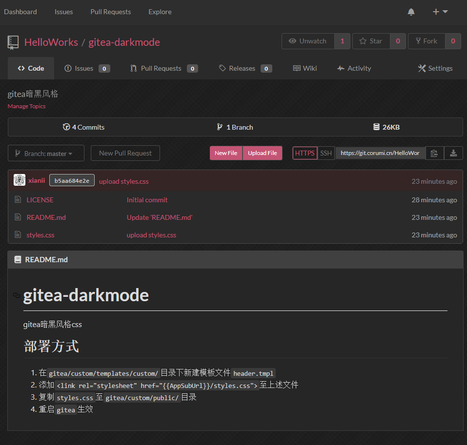

# gitea-darkmode
Another gitea dark style

Inspired from https://github.com/StylishThemes/GitHub-Dark-Script

## How to deploy

1. Create `header.tmpl` in the `gitea/custom/templates/custom/` directory
1. add line `<link rel="stylesheet" href="{{AppSubUrl}}/styles.css">` in the file above
1. copy `styles.css` to `gitea/custom/public/` directory
1. restart `gitea` 

## Known issue

1. the style of `Heatmap` can not be set from css, I'm trying to find another way other than recompile the `gitea`

